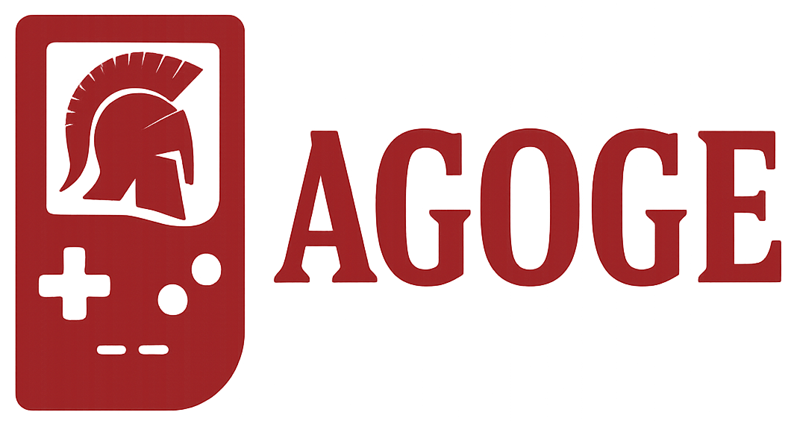

        

        

 

## Introduction

agoge is a work in progress [Game Boy](https://en.wikipedia.org/wiki/Game_Boy)
emulator written in
the [C programming language](https://en.wikipedia.org/wiki/C_(programming_language))
targeting
the [ISO/IEC 9899:2018 (C17) standard](https://en.wikipedia.org/wiki/C17_(C_standard_revision)).

This project only supports two compilers:

- [gcc >=11.4.0](https://gcc.gnu.org/)
- [clang >=14.0.0](https://clang.llvm.org/)
